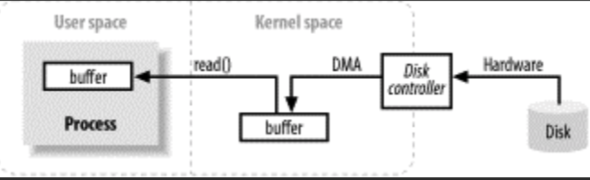
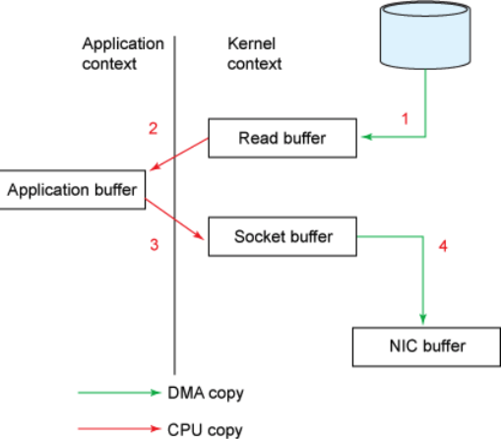
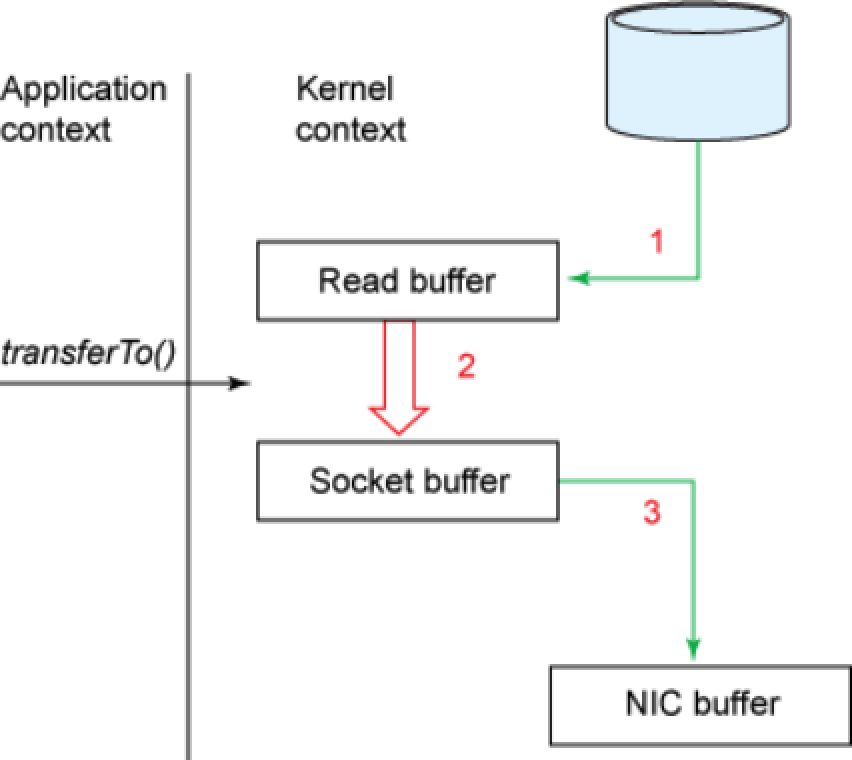
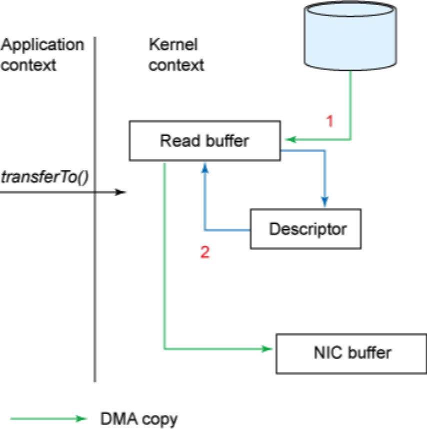
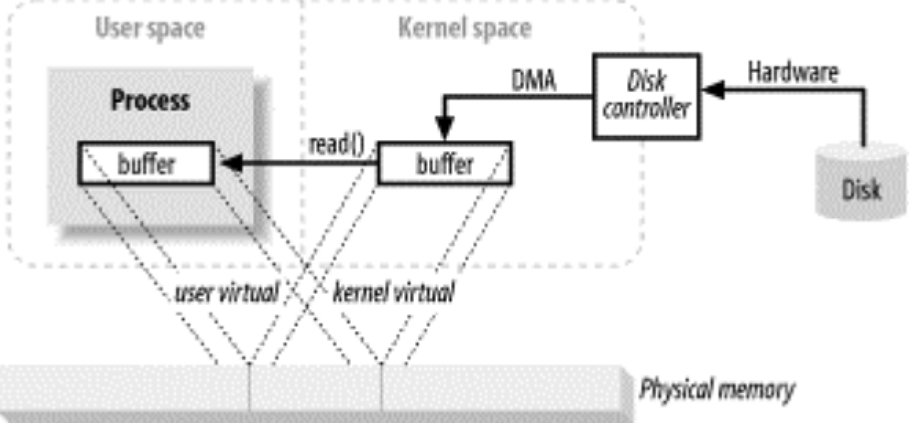
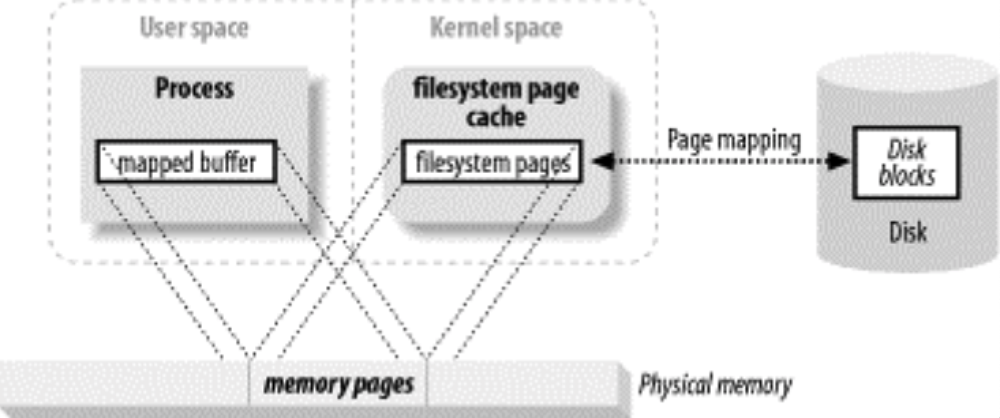
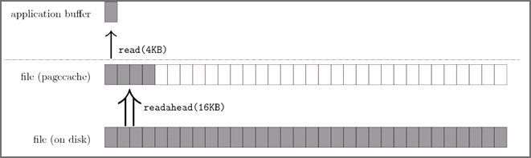

## Java-IO

### 普通 IO



**整个 IO 过程的流程如下：**

1)下面 **buffer** 就是一个**缓冲区（用户缓冲区）**：

```
//传统方式
byte[] buffer = new byte[4096];
//read() 触发"syscall read"系统调用
while((read = inputStream.read(buffer))>=0) {
        total = total + read;
            // other code....
}

//文件通道
ByteBuffer buffer = ByteBuffer.allocate(4096)；
//从当前文件指针的位置读取 4KB 的数据
//read() 触发"syscall read"系统调用
fileChannel.read(buffer);
```

2)当执行 **read()** 方法时，底层的操作：

①在 DMA 的控制下，把磁盘上的数据读入到**内核缓冲区**；

②内核把数据从**内核**缓冲区复制到**用户**缓冲区。

③此时，可操作 buffer 数据 。

### Zero copy（零拷贝）

IO 操作需要数据频繁地在内核缓冲区和用户缓冲区之间拷贝（[原因？](https://www.jianshu.com/p/007052ee3773)），而 zero copy 技术可以减少这种拷贝的次数，同时也降低了上下文切换(用户态与内核态之间的切换)的次数，提高 IO 密集型应用程序的性能，减少 CPU 和内存的消耗。

经典场景：web 服务从磁盘中读文件，并把文件通过网络 (socket) 发送给 Client

```java
File.read(fileDesc, buf, len);
Socket.send(socket, buf, len);
```



①read() 触发，用户态切换到内核态，在 DMA 的控制下，把磁盘上的数据读入到**内核缓冲区**；

②内核把数据从**内核**缓冲区复制到**用户**缓冲区，read() 返回，内核态返回到用户态；

③send() 触发，把数据从**用户**缓冲区复制到**内核**缓冲区，用户态切换到内核态；

④内核把数据从**内核**缓冲区复制到 **NIC** 缓冲区，send() 返回，内核态返回到用户态。

**整个过程：4次数据复制、4次上下文切换**

#### 基于 Zerocopy 流程

java.nio.channels.FileChannel 类的 transferTo() 方法可以直接将字节传送到可写的通道中 (Writable Channel)，并不需要将字节送入用户程序空间(用户缓冲区)。




```java
fileChannel.transferTo(position, count, socketChannel)
```

①transferTo() 触发，用户态切换到内核态，在 DMA 的控制下，把磁盘上的数据读入到 **Read缓冲区**；

②**内核态**下，内核把数据从 **Read** 缓冲区复制到 **Socket** 缓冲区；

③内核把数据从 **Socket** 缓冲区复制到 **NIC** 缓冲区，send() 返回，内核态返回到用户态；

**整个过程：3次数据复制、2次上下文切换**


**底层的网络硬件以及操作系统支持，整个过程：2次数据复制、2次上下文切换**



①transferTo() 触发，用户态切换到内核态，在 DMA 的控制下，把磁盘上的数据读入到 **Read缓冲区**；

②用一个描述符标记此次待传输数据的地址以及长度，DMA 直接把数据从 **Read buffer** 传输到 **NIC buffer**，内核态返回到用户态

### DirectByteBuffer	



**整个 IO 过程的流程如下：**

1)下面 **buffer** **（DirectByteBuffer）**：

```
//文件通道
ByteBuffer buffer = ByteBuffer.allocateDirect(4096)；
//从当前文件指针的位置读取 4KB 的数据
//read() 触发"syscall read"系统调用
fileChannel.read(buffer);
```

2)当执行 **read()** 方法时，底层的操作：

①在 DMA 的控制下，把磁盘上的数据读入到**内核缓冲区**（个人理解：堆外内存属于内核缓冲区一部分，数据直接读入buffer 指向的堆外内存）；

②此时，可操作 buffer 数据 。


### MMAP（内存映射）




**整个 IO 过程的流程如下：**

1)下面 mappedByteBuffer 就是一个**映射缓冲区**：内存映射 I/O 使用文件系统建立从用户空间直到可用文件系统页的虚拟内存映射

```
// 获取MMAP的方式
MappedByteBuffer mappedByteBuffer = fileChannel.map(FileChannel.MapMode.READ_WRITE, 0, filechannel.size();

// 读
byte[] buffer = new byte[4096];
//从当前 mmap 指针的位置读取 4KB 的数据
mappedByteBuffer.get(data)；
```

2)当执行 get() 方法时，底层的操作：

①虚拟内存管理系统根据缺页加载的机制从磁盘加载对应的数据块到物理内存（mappedByteBuffer）；

②此时，可操作 buffer 数据 。

## 应用场景及使用

#### DirectByteBuffer 应用

1. 堆外内存适用于生命周期中等或较长的对象。( 如果是生命周期较短的对象，在 YGC 的时候就被回收了，就不存在大内存且生命周期较长的对象在 FGC 对应用造成的性能影响 )。
2. 直接的文件拷贝操作或者 I/O 操作。（直接使用堆外内存就能少去内存从用户内存拷贝到系统内存的消耗）。
3. 使用 池+堆外内存 的组合方式，对生命周期较短，但涉及到 I/O 操作的对象进行堆外内存的再使用( Netty )。
4. 创建堆外内存的消耗要大于创建堆内内存的消耗，分配堆外内存后，尽可能复用。

#### MMAP 应用

1. MMAP 使用时必须实现指定好内存映射的大小，并且一次 map 的大小限制在 1.5G 左右，重复 map 又会带来虚拟内存的回收、重新分配的问题，对于文件不确定大小的情形实在是太不友好了。
2. MMAP 使用的是虚拟内存，和 PageCache 一样是由操作系统来控制刷盘的，虽然可以通过 force() 来手动控制，但这个时间把握不好，在小内存场景下会很令人头疼。
3. MMAP 的回收问题，当 MappedByteBuffer 不再需要时，可以手动释放占用的虚拟内存，但…方式非常的诡异。

## 知识点梳理

#### 内存管理

**MMU**：CPU的内存管理单元（[IO 操作详细图参考](https://blog.csdn.net/linxdcn/article/details/72903422)）。

**物理内存**：即内存条的内存空间。

**虚拟内存**：计算机系统内存管理的一种技术。它使得应用程序认为它拥有连续的可用的内存（一个连续完整的地址空间），而实际上，它通常是被分隔成多个物理内存碎片，还有部分暂时存储在外部磁盘存储器上，在需要时进行数据交换。

**缺页中断**：当程序试图访问已映射在虚拟地址空间中但未被加载至物理内存的一个分页时，由MMC发出的中断。如果操作系统判断此次访问是有效的，则尝试将相关的页从虚拟内存文件中载入物理内存。

#### DirectByteBuffer（直接内存 或 堆外内存）

普通的文件读写，实际隐式使用堆外内存（[原因？](https://www.jianshu.com/p/007052ee3773)）。

```
读文件: 文件(disk)=>堆外内存=>堆内内存;(过程中JVM保证不GC)
写文件: 堆内内存=>堆外内存=>文件(disk)。
```

显示使用：ByteBuffer.allocateDirect(4 * 1024)

#### PageCache

引入Cache层的目的是为了提高Linux操作系统对磁盘访问的性能。Cache层在内存中缓存了磁盘上的部分数据。当数据的请求到达时，如果在Cache中存在该数据且是最新的，则直接将数据传递给用户程序，免除了对底层磁盘的操作，提高了性能。

磁盘Cache有两大功能：

预读：系统读入所请求的页面并读入紧随其后的少数几个页面；

回写：通过暂时将数据存在Cache里，然后统一异步写到磁盘中。

#### 顺序读写速度>随机读写速度

PageCache，位于 **用户缓冲区** 和 **磁盘** 之间的一层缓存



以顺序读为例，当用户发起一个 fileChannel.read(4KB) 之后，实际发生了两件事

1. 操作系统从磁盘加载了 16KB 进入 PageCache，这被称为预读
2. 操作通从 PageCache 拷贝 4KB 进入用户内存

最终我们在用户内存访问到了 4KB，为什么顺序读快？很容量想到，当用户继续访问接下来的[4kb,16kb]的磁盘内容时，便是直接从 PageCache 去访问

#### UNSAFE（直接内存与内存的拷贝）

```java
ByteBuffer buffer = ByteBuffer.allocateDirect(4 * 1024 * 1024);
long addresses = ((DirectBuffer) buffer).address();
byte[] data = new byte[4 * 1024 * 1024];
UNSAFE.copyMemory(data, 16, null, addresses, 4 * 1024 * 1024);
```

copyMemory 方法可以实现内存之间的拷贝，无论是堆内和堆外，1~2 个参数是 source 方，3~4 是 target 方，第 5 个参数是 copy 的大小。如果是堆内的字节数组，则传递数组的首地址和 16 这个固定的 ARRAY_BYTE_BASE_OFFSET 偏移常量；如果是堆外内存，则传递 null 和直接内存的偏移量，可以通过 ((DirectBuffer) buffer).address() 拿到。为什么不直接拷贝，而要借助 UNSAFE？当然是因为它快啊！

## 其他相关

[理解字节序](http://www.ruanyifeng.com/blog/2016/11/byte-order.html)

[Netty ByteBuf 和 Nio ByteBuffer](https://blog.csdn.net/jeffleo/article/details/69230112)

[Java NIO浅析](https://tech.meituan.com/2016/11/04/nio.html)

## 巨人肩膀

《JAVA NIO》O'Reilly 出版社

[JAVA IO 以及 NIO 理解](https://www.cnblogs.com/hapjin/p/5736188.html)，博客园，2016

[Java直接内存原理](https://juejin.im/post/5cb48201f265da03b0515294)，掘金，2019

[Java 中为什么要用 ByteBuffer 代替 byte 操作字节数据？](https://www.zhihu.com/question/49938713)，知乎，2016

[堆外内存 之 DirectByteBuffer 详解](https://www.jianshu.com/p/007052ee3773)，简书，2017

[堆外内存DirectByteBuffer](https://xiaoyue26.github.io/2018/08/18/2018-08/%E5%A0%86%E5%A4%96%E5%86%85%E5%AD%98DirectByteBuffer/)，某博客，2018

[文件IO操作的最佳实践](https://www.cnkirito.moe/file-io-best-practise/)，某博客，2018

[磁盘I/O那些事](https://tech.meituan.com/2017/05/19/about-desk-io.html)，美团技术团队博客，2017

[认真分析mmap：是什么 为什么 怎么用](https://www.cnblogs.com/huxiao-tee/p/4660352.html)，博客园，2016

[浅析Linux中的零拷贝技术](https://www.jianshu.com/p/fad3339e3448)，简书，2017

[深入浅出MappedByteBuffer](https://www.jianshu.com/p/f90866dcbffc)，简书，2016

[MappedByteBuffer VS FileChannel 孰强孰弱？](https://juejin.im/post/5cd82323f265da038932b1e6)，掘金，2019