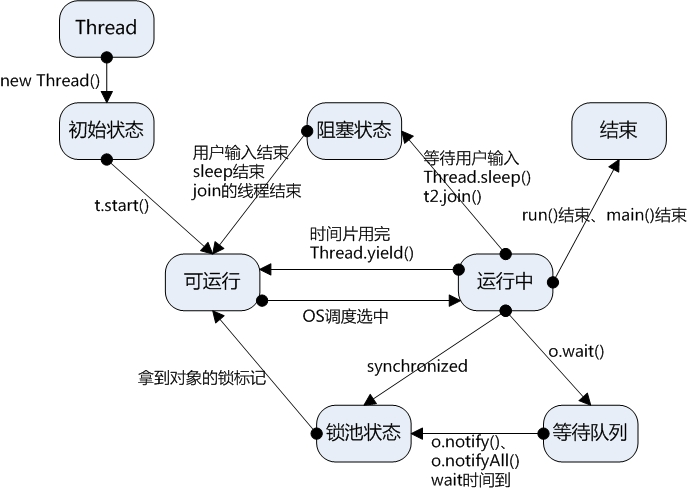
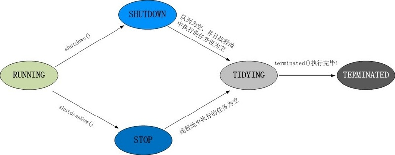

## 线程

### 知识点梳理

#### 关键概念

**进程**：每个进程都有独立的代码和数据空间（进程上下文），进程间的切换会有较大的开销，一个进程包含 1-n 个线程。（进程是资源分配的最小单位）

**线程**：同一类线程共享代码和数据空间，每个线程有独立的运行栈和程序计数器( PC )，线程切换开销小。（线程是 cpu 调度的最小单位）

**java 程序启动最少启动 2 个线程**：main 线程、垃圾回收线程。

**线程优先级**：JVM 提供了 10 个线程优先级，取值范围是 1~10，但与常见的操作系统都不能很好的映射。建议使用 Thread 类静态常量

> static int MAX_PRIORITY
>           线程可以具有的最高优先级，取值为10。
> static int MIN_PRIORITY
>           线程可以具有的最低优先级，取值为1。
> static int NORM_PRIORITY
>           分配给线程的默认优先级，取值为5。

#### 基本组件

Java 实现多线程的手段：继承 *Thread* 类，实现 *Runable* 接口

**Thread**：继承 *Thread* 类，重写 run()，主要涉及函数：

>**①sleep(long millis)**：在指定的毫秒数内让当前正在执行的线程休眠（暂停执行），允许较低优先级的线程获得运行机会。
>
>**②join()**
>
>**③yield()**： 让当前运行线程回到可运行状态，允许具有相同优先级的其他线程获得运行机会。
>
>**④setPriority()**
>
>**⑤interrupt()**：不要以为它是中断某个线程！它只是向线程发送一个中断信号，让线程在无限等待时（如死锁时）能抛出异常，从而结束线程，但是如果你吃掉了这个异常，那么这个线程还是不会中断的！
>
>**⑥wait()（Object 对象函数）**：Obj.wait()，与 Obj.notify() 必须要与 synchronized(Obj) 一起使用
>
>**⑦notify()**
>
>详见线程状态状态

**Runable**：实现 *Runable* 接口，重写 run()，主要函数：

实现Runnable接口比继承Thread类所具有的优势：

- 适合多个相同的程序代码的线程去处理同一个资源

- 可以避免 java 中的单继承的限制

- 增加程序的健壮性，代码可以被多个线程共享，代码和数据独立

- 线程池只能放入实现 Runable 或 Callable 类线程，不能直接放入继承 Thread 的类

### 线程状态转换

> 新建状态（New）：新创建了一个线程对象。
> 
> 就绪状态（Runnable）：线程对象创建后，其他线程调用了该对象的 start() 方法。该状态的线程位于可运行线程池中，变得可运行，等待获取 CPU 的使用权。
> 
> 运行状态（Running）：就绪状态的线程获取了 CPU ，执行程序代码。
> 
> 阻塞状态（Blocked）：阻塞状态是线程因为某种原因放弃 CPU 使用权，暂时停止运行。直到线程进入就绪状态，才有机会转到运行状态。阻塞的情况分三种：
> （一）等待阻塞：运行的线程执行 wait() 方法，JVM 会把该线程放入等待池中。( wait 会释放持有的锁)
> （二）同步阻塞：运行的线程在获取对象的同步锁时，若该同步锁被别的线程占用，则 JVM 会把该线程放入锁池中。
> （三）其他阻塞：运行的线程执行 sleep() 或 join() 方法，或者发出了 I/O 请求时，JVM 会把该线程置为阻塞状态。当 sleep() 状态超时、join() 等待线程终止或者超时、或者 I/O 处理完毕时，线程重新转入就绪状态。（注意, sleep 是不会释放持有的锁）
> 
> 死亡状态（Dead）：线程执行完了或者因异常退出了 run() 方法，该线程结束生命周期。



#### sleep()  vs yield()

- sleep() 使当前线程进入停滞状态，所以执行 sleep() 的线程在指定的时间内肯定不会被执行，时间的长短是由程序设定的，允许较低优先级的线程获得运行机会
- yield() 只是使当前线程重新回到可执行状态，所以执行 yield() 的线程有可能在进入到可执行状态后马上又被执行，让出 CPU 的时间是不可设定的，并且把运行机会让给了同等优先级的其他线程

#### sleep() vs Obj.wait() 

- 在多线程的环境下，都可以在程序的调用处阻塞指定的毫秒数，并返回

- 都可以通过 interrupt() 方法打断线程的暂停状态 ，从而使线程立刻抛出 InterruptedException


> 如果线程 A 希望立即结束线程 B，则可以对线程 B 对应的 Thread 实例调用 interrupt 方法。如果此刻线程 B正在 wait/sleep /join，则线程 B 会立刻抛出 InterruptedException，在 catch() {} 中直接 return 即可安全地结束线程。
>
> 需要注意的是，InterruptedException 是线程自己从内部抛出的，并不是 interrupt() 方法抛出的。对某一线程调用 interrupt() 时，如果该线程正在执行普通的代码，那么该线程根本就不会抛出InterruptedException。但是，一旦该线程进入到 wait()/sleep()/join() 后，就会立刻抛出InterruptedException 。

- sleep() 睡眠时，保持对象锁，仍然占有该锁；而 wait() 睡眠时，释放对象锁。

每个对象都有一个锁来控制同步访问。Synchronized 关键字可以和对象的锁交互，来实现线程的同步。wait/notify/notifyAll 只能在同步控制方法或者同步控制块里面使用，而 sleep 可以在任何地方使用。故

### 线程池创建

#### 常见线程池方式

- `Executors.newCachedThreadPool()`：无限线程池。
- `Executors.newFixedThreadPool(nThreads)`：创建固定大小的线程池。
- `Executors.newSingleThreadExecutor()`：创建单个线程的线程池。

实际上还是利用 `ThreadPoolExecutor` 类实现（[线程池原理](java-threadpool.md)）

```java
ThreadPoolExecutor(int corePoolSize, int maximumPoolSize, long keepAliveTime, TimeUnit unit, BlockingQueue<Runnable> workQueue, RejectedExecutionHandler handler)
```

> 【强制】线程资源必须通过线程池提供，不允许在应用中自行显式创建线程。说明:使用线程池的好处是减少在创建和销毁线程上所花的时间以及系统资源的开销，解决资 源不足的问题。如果不使用线程池，有可能造成系统创建大量同类线程而导致消耗完内存或者“过度切换”的问题。
>
> 【强制】线程池不允许使用 Executors 去创建，而是通过 ThreadPoolExecutor 的方式，这样 的处理方式让写的同学更加明确线程池的运行规则，规避资源耗尽的风险。说明:Executors 返回的线程池对象的弊端如下:
> 1)FixedThreadPool 和 SingleThreadPool:
> 允许的请求队列长度为 Integer.MAX_VALUE，可能会堆积大量的请求，从而导致 OOM。
> 2)CachedThreadPool 和 ScheduledThreadPool:
> 允许的创建线程数量为 Integer.MAX_VALUE，可能会创建大量的线程，从而导致 OOM。

​																																	   ----《阿里巴巴 Java 开发手册》

#### ThreadPoolExecutor 核心参数

- `corePoolSize` 为线程池的基本大小。
- `maximumPoolSize` 为线程池最大线程大小。
- `keepAliveTime` 和 `unit` 则是线程空闲后的存活时间。
- `workQueue` 用于存放任务的阻塞队列。
- `handler` 当队列和最大线程池都满了之后的饱和策略

#### 线程池状态转换

> `RUNNING` 自然是运行状态，指可以接受任务执行队列里的任务
>
> `SHUTDOWN` 指调用了 `shutdown()` 方法，不再接受新任务了，但是队列里的任务得执行完毕。
>
> `STOP` 指调用了 `shutdownNow()` 方法，不再接受新任务，同时抛弃阻塞队列里的所有任务并中断所有正在执行任务。
>
> `TIDYING` 所有任务都执行完毕，在调用 `shutdown()/shutdownNow()` 中都会尝试更新为这个状态。
>
> `TERMINATED` 终止状态，当执行 `terminated()` 后会更新为这个状态。



**提交任务及关闭线程池**

```java
long start = System.currentTimeMillis();
for (int i = 0; i <= 5; i++) {
  //提交任务
  pool.execute(new Job());
}
//关闭线程池，停止接受新任务，会把队列的任务执行完毕
pool.shutdown();

//每隔一秒钟检查一次是否执行完毕（状态为 TERMINATED），当从 while 循环退出时就表明线程池已经完全终止
while (!pool.awaitTermination(1, TimeUnit.SECONDS)) {
  LOGGER.info("线程还在执行。。。");
}
long end = System.currentTimeMillis();
LOGGER.info("一共处理了【{}】", (end - start));
```

**SpringBoot 方式**

```java
@Configuration
public class TreadPoolConfig {
    /**
     * 消费队列线程
     * @return
     */
    @Bean(value = "consumerQueueThreadPool")
    public ExecutorService buildConsumerQueueThreadPool(){
        ThreadFactory namedThreadFactory = new ThreadFactoryBuilder()
                .setNameFormat("consumer-queue-thread-%d").build();

        ExecutorService pool = new ThreadPoolExecutor(5, 5, 0L, TimeUnit.MILLISECONDS,
                new ArrayBlockingQueue<Runnable>(5),namedThreadFactory,new ThreadPoolExecutor.AbortPolicy());

        return pool ;
    }
}
```

```JAVA
@Resource(name = "consumerQueueThreadPool")
private ExecutorService consumerQueueThreadPool;

@Override
public void execute() {
  //消费队列
  for (int i = 0; i < 5; i++) {
    consumerQueueThreadPool.execute(new ConsumerQueueThread());
  }
}
```

#### 配置线程池

IO 密集型任务：由于线程并不是一直在运行，所以可以尽可能的多配置线程，比如 CPU 个数 * 2

CPU 密集型任务（大量复杂的运算）应当分配较少的线程，比如 CPU 个数相当的大小。

[如何合理地估算线程池大小？](http://ifeve.com/how-to-calculate-threadpool-size/)

#### 线程池隔离

Hystrix(TODO)

### 巨人肩膀

[Java多线程学习（吐血超详细总结）](https://blog.csdn.net/evankaka/article/details/44153709)，CSDN，2015

[如何优雅的使用和理解线程池](https://segmentfault.com/a/1190000015808897)，segmentfault，2018

《阿里巴巴Java开发手册》