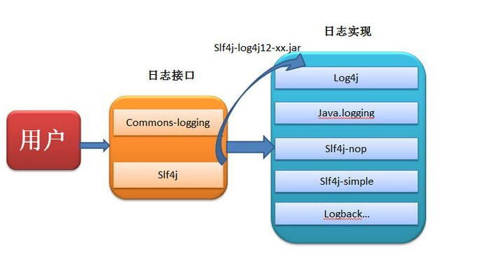
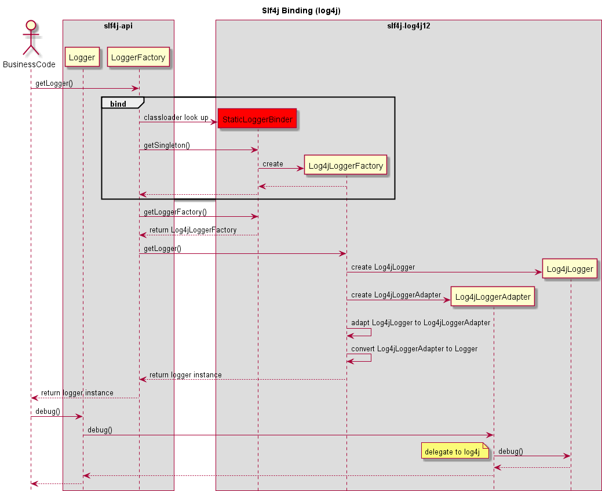

## 总览



目前的日志框架有JDK自带的`logging`，`log4j1`、`log4j2`、`logback` ，这些框架都自己定制了日志 API ，并且有相应的实现；目前用于实现日志统一的框架 `Apache commons-logging`、`slf4j` ，遵循面向接口编程的原则，这两大框架可以让用户在程序运行期间去选择具体的日志实现系统（`log4j1\log4j2\logback`等）来记录日志，是统一抽象出来的一些接口。

## 关键



slf4j 在运行时绑定具体的log api实现，关键之处就在于 org.slf4j.impl.StaticLoggerBinder 

```
LoggerFactory的bind()方法
...
// the next line does the binding
StaticLoggerBinder.getSingleton();
...
```


## 巨人肩膀

[Java常用的日志框架对比](https://www.jianshu.com/p/bbbdcb30bba8)

[Java日志框架：slf4j作用及其实现原理](https://www.cnblogs.com/xrq730/p/8619156.html)

[Log4j源码解析--框架流程+核心解析](https://blog.csdn.net/u011794238/article/details/50736331)

[slf4j初始化绑定源码分析](https://skyao.github.io/2014/07/21/slfj4-binding/)