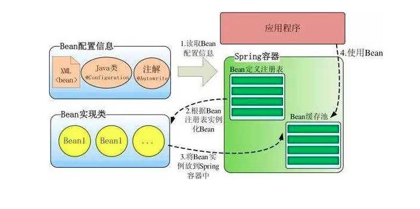
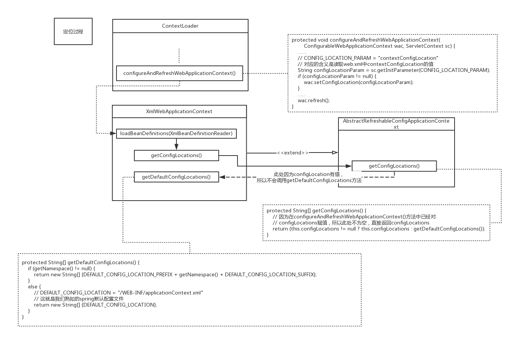
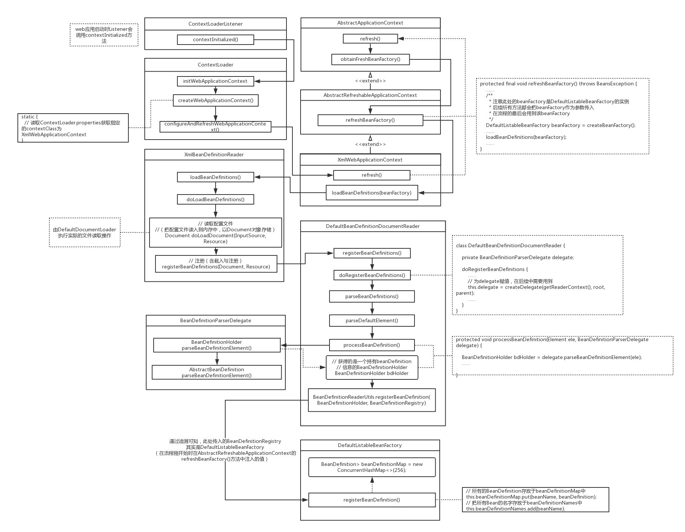

## Spring

### 知识点准备

#### 关键概念

**IoC/DI**

```
public class HelloService {
  public void hello(String name) {
    System.out.println("Hello:" + name);
  }
}
```

```
/**long long ago*/
System.out.println("shake " + name+"'s hands");  
//调用方主动创建 Bean
HelloService helloService = new HelloService();
helloService.hello("Bug");
```

```
/**with Spring*/
//IoC（Inversion of Control 控制反转）：调用方发出请求，Bean 的创建由 IoC 容器控制
//DI（Dependency Injection 依赖注入）：调用方通过 IoC 容器获取 Bean 资源，注入方式：构造注入，设置注入，接口注入
@Autowire
private HelloService helloService;
public void handshake(String name) {
  System.out.println("shake " + name+"'s hands");  
  helloService.hello(name);
}
```

**AOP**

| Method1    | Method2    | Method3    |
| ---------- | ---------- | ---------- |
| 代码 A     | 代码 A     | 代码 A     |
| 业务代码 X | 业务代码 Y | 业务代码 Z |
| 代码 B     | 代码 B     | 代码 B     |

从纵向看，方法 1、2、3 都执行了相同的 A、B 代码，一个典型的场景就是：开启事务，更新表里数据，提交/回滚事务；  开启事务，删除表里数据，提交/回滚事务。

AOP（Aspect Oriented Programming 面向切面编程）则是主要解决 如何将独立的横切逻辑（代码A、B）融合到业务逻辑（业务代码X、Y、Z）中来完成和原来一样的业务操作

**注入方式**

- Constructor 注入能够强制要求调用者注入构造函数中的所有参数，否则在容器初始化时就会失败；但是如果要注入的对象过多，就会导致**构造函数过于庞大**。
- Setter 注入，类似于 Builder 模式，将原本庞大的构造函数，拆解为了**一个小的构造函数**和**许多个 set 方法**。setter 注入不能保证对象一定会被注入，但是可以使用 **@Required** 注解，强制要求使用者注入对象，否则在容器初始化时就会报错。

**[Bean 配置方式](https://blog.csdn.net/icarus_wang/article/details/51649635) （XML、注解、Java Config）**

- xml 配置相对于其他两种方式来说，几乎没什么优势，唯一的优势就是**修改后不需要重新编译**，因此**对于一些经常切换实现类的对象，可以采用 xml 的方式进行配置**。还有就是由于 xml 是 Spring一开始就提供的配置方式，因此很多旧代码还是采用 xml，所以在维护旧代码时会免不了用到 xml。
- **注解用起来非常地简洁，代码量十分少，因此是项目的第一选择**。只有当需要注入代码不是自己维护的第三方 jar 包中的类时，或者需要更为灵活地注入，比如说需要调用某个接口，查询数据，然后把这个数据赋值给要注入的对象，那么这时候就需要用到 Java Config。

**事务**

[实战Spring事务传播性与隔离性](https://www.jianshu.com/p/249f2cd42692)（TODO）

#### 基础组件

**BeanFactory**：Spring 底层容器，定义了最基本的容器功能

**ApplicationContext**：扩展于 BeanFactory，拥有更丰富的功能。例如：添加事件发布机制、父子级容器，一般都是直接使用 ApplicationContext

**BeanDefinition**：BeanDefinition 定义了 bean 的基本信息，根据它来创造 bean

**[SmartLifecycle](http://www.ishenping.com/ArtInfo/1618723.html)**： 在容器所有 bean 加载和初始化完毕执行。有时候我们需要在 Spring 加载和初始化所有 bean 后，接着执行一些任务或者启动需要的异步服务，这样我们可以使用 SmartLifecycle 来做到。SmartLifecycle 是一个接口。当 Spring 容器加载所有 bean 并完成初始化之后，会接着回调实现该接口的类中对应的方法（ start() 方法）。

**[BeanPostProcessor](https://www.jianshu.com/p/1417eefd2ab1)**： 可在 Spring 容器管理的 bean 进行再加工。比如：修改 bean 的属性，可以给 bean 生成一个动态代理实例等等。

#### 设计模式

代理模式（动态代理、静态代理）

工厂模式

单例模式

委派模式

策略模式

模版模式


### Spring 启动分析

> Spring 的启动过程实际上就是 Ioc 容器初始化以及载入 Bean 的过程。



> Spring 只帮我们管理单例模式 Bean 的**完整**生命周期，对于 prototype 的 bean ，Spring 在创建好交给使用者之后则不会再管理后续的生命周期。


> （ Java Web）启动一般从 web.xml 载入开始，通过 ContextLoaderListener [监听器](../Java-WEB/servlet.md)进行 Spring 容器初始化，Java Web 容器中相关组件的启动顺序是 ServletContext -> Listener -> Filter -> Servlet， Listener 启动时会调用 contextInitialized 方法。

```xml
<listener>  
     <listener-class>org.springframework.web.context.ContextLoaderListener</listener-class> 
</listener> 
<context-param>  
    <param-name>contextConfigLocation</param-name>  
    <param-value>classpath:applicationContext.xml</param-value>  
</context-param> 
```

#### Spring 容器初始化主要步骤

1. *定位 - 获取配置文件路径*

   

2. *加载 - 把配置文件读取成 BeanDefinition*

3. *注册 - 存储 BeanDefinition*

4. *实例化 - 根据 BeanDefinition 创建实例*

   


## 巨人肩膀

[Spring源码分析专题 —— IOC容器启动过程](https://blog.leapmie.com/archives/390/)，leapmie博客，2018

[SPRING容器启动过程](https://zhuanlan.zhihu.com/p/32830470)，知乎，2018

[Spring Bean 的生命周期](https://juejin.im/post/5ab1bf19f265da23771947f1)，掘金，2018